```mermaid
erDiagram

  %% -------------------------
  %% 設定・年度
  %% -------------------------

  fiscal_year_settings {
    int      id                       PK
    int      fiscal_year_start_month  "会計年度開始月(1-12) デフォルト4"
    timestamp updated_at
    int      updated_by               FK
  }

  fiscal_years {
    int      id               PK
    varchar  name             "例: FY2025"
    date     start_date
    date     end_date
    date     input_start_date "参考情報"
    date     input_end_date   "参考情報"
    boolean  is_active
    timestamp created_at
    timestamp updated_at
  }

  %% -------------------------
  %% レベルマスタ
  %% -------------------------

  skill_levels {
    int      id           PK
    int      level_value  "採点数値"
    varchar  description  "例: 知識がある"
    boolean  is_active
  }

  %% -------------------------
  %% ITスキル関連マスタ
  %% -------------------------

  it_skill_categories {
    int      id         PK
    int      parent_id  FK "NULLが分類1ルート"
    int      level      "1/2/3"
    varchar  name
    int      sort_order
    boolean  is_active
  }

  it_skills {
    int      id           PK
    int      category_id  FK
    varchar  name
    text     description  "nullable"
    int      sort_order
    boolean  is_active
    timestamp created_at
    timestamp updated_at
  }

  %% -------------------------
  %% 資格マスタ
  %% -------------------------

  qualifications {
    int      id          PK
    varchar  name
    text     description "nullable"
    int      sort_order
    boolean  is_active
    timestamp created_at
    timestamp updated_at
  }

  %% -------------------------
  %% ADセミナーマスタ
  %% -------------------------

  ad_seminars {
    int      id          PK
    varchar  name
    text     description "nullable"
    int      sort_order
    boolean  is_active
    timestamp created_at
    timestamp updated_at
  }

  %% -------------------------
  %% ユーザー・チーム
  %% -------------------------

  users {
    int      id                  PK
    varchar  name
    varchar  email               UK
    varchar  password_hash
    varchar  role                "GENERAL / TL / ADMIN"
    int      tl_user_id          FK "nullable: TLへの自己参照"
    boolean  is_initial_password "true=初回ログイン時パスワード変更強制"
    boolean  is_active
    timestamp created_at
    timestamp updated_at
  }

  %% -------------------------
  %% 棚卸ヘッダー
  %% -------------------------

  inventories {
    int      id                 PK
    int      user_id            FK
    int      fiscal_year_id     FK
    varchar  status             "DRAFT / PENDING_GOAL / COMPLETED"
    timestamp submitted_at      "nullable"
    timestamp goal_completed_at "nullable"
    timestamp created_at
    timestamp updated_at
  }

  %% -------------------------
  %% 棚卸明細
  %% -------------------------

  it_skill_details {
    int      id                PK
    int      inventory_id      FK
    int      it_skill_id       FK "nullable: NULLはカスタムスキル"
    varchar  custom_skill_name "nullable"
    int      skill_level_id    FK
    text     remarks           "採点根拠 nullable"
    timestamp created_at
    timestamp updated_at
  }

  qualification_details {
    int      id                        PK
    int      inventory_id              FK
    int      qualification_id          FK "nullable: NULLはカスタム資格"
    varchar  custom_qualification_name "nullable"
    date     acquired_year_month       "nullable: 月初日で保存"
    text     remarks                   "取得理由 nullable"
    timestamp created_at
    timestamp updated_at
  }

  seminar_details {
    int      id                   PK
    int      inventory_id         FK
    int      ad_seminar_id        FK "nullable: NULLはフリーセミナー"
    varchar  seminar_name         "nullable: フリーセミナー時に使用"
    date     attended_year_month  "nullable: 月初日で保存"
    text     remarks              "受講理由・振り返り nullable"
    timestamp created_at
    timestamp updated_at
  }

  %% -------------------------
  %% 目標設定
  %% -------------------------

  inventory_goals {
    int      id               PK
    int      inventory_id     FK
    varchar  goal_category    "IT_SKILL / QUALIFICATION / AD"
    int      it_skill_id      FK "nullable"
    int      qualification_id FK "nullable"
    int      ad_seminar_id    FK "nullable"
    varchar  custom_name      "カスタムスキル・資格目標時の自由テキスト nullable"
    date     target_period    "達成・予定時期: 月初日で保存"
    text     reason           "理由 nullable"
    timestamp created_at
    timestamp updated_at
  }

  %% -------------------------
  %% リレーション
  %% -------------------------

  fiscal_year_settings  ||--o{  users                 : "updated_by"
  fiscal_years          ||--o{  inventories            : "has"
  it_skill_categories   ||--o{  it_skill_categories   : "parent(self-ref)"
  it_skill_categories   ||--o{  it_skills             : "classifies"
  users                 |o--o{  users                 : "tl_of(self-ref)"
  users                 ||--o{  inventories           : "owns"
  inventories           ||--o{  it_skill_details      : "contains"
  inventories           ||--o{  qualification_details : "contains"
  inventories           ||--o{  seminar_details       : "contains"
  inventories           ||--o{  inventory_goals       : "has"
  skill_levels          ||--o{  it_skill_details      : "scored_by"
  it_skills             |o--o{  it_skill_details      : "referenced_by"
  it_skills             |o--o{  inventory_goals       : "targeted_by"
  qualifications        |o--o{  qualification_details : "referenced_by"
  qualifications        |o--o{  inventory_goals       : "targeted_by"
  ad_seminars           |o--o{  seminar_details       : "referenced_by"
  ad_seminars           |o--o{  inventory_goals       : "targeted_by"
```

# ER図

**バージョン**: 1.0.0  
**作成日**: 2026-05-09

関連資料：[データモデル（概念設計）](./data-model.md)

---

---

## 補足

### NULLを許容するFK

| テーブル | カラム | NULLの意味 |
|----------|--------|-----------|
| `it_skill_details` | `it_skill_id` | カスタムスキル（`custom_skill_name` を使用） |
| `qualification_details` | `qualification_id` | カスタム資格（`custom_qualification_name` を使用） |
| `seminar_details` | `ad_seminar_id` | フリーセミナー（`seminar_name` を使用） |
| `inventory_goals` | `it_skill_id` / `qualification_id` / `ad_seminar_id` | `goal_category` に応じて1つのみ設定。カスタム目標は `custom_name` を使用 |
| `users` | `tl_user_id` | TL未設定ユーザー |

### 年月の保存方法

`acquired_year_month`・`attended_year_month`・`target_period` は `date` 型で保存し、常に**月初日（1日）**を格納する。  
例：2025年4月 → `2025-04-01`
