```mermaid
erDiagram

  %% -------------------------
  %% 設定・年度
  %% -------------------------

  fiscal_year_settings {
    int      id                       PK
    int      fiscal_year_start_month  "会計年度開始月(1-12) デフォルト4"
    timestamp updated_at
    int      updated_by               FK
  }

  fiscal_years {
    int      id               PK
    varchar  name             "例: FY2025"
    date     start_date
    date     end_date
    date     input_start_date "参考情報"
    date     input_end_date   "参考情報"
    boolean  is_active
    timestamp created_at
    timestamp updated_at
  }

  %% -------------------------
  %% レベルマスタ
  %% -------------------------

  skill_levels {
    int      id           PK
    int      level_value  "採点数値"
    varchar  description  "例: 知識がある"
    int      score_weight "グラフスコア重み。0はスコア寄与なし"
    boolean  is_active
  }

  %% -------------------------
  %% ITスキル関連マスタ
  %% -------------------------

  it_skill_categories {
    int      id         PK
    int      parent_id  FK "NULLが分類1ルート"
    int      level      "1/2/3"
    varchar  name
    int      sort_order
    boolean  is_active
  }

  it_skills {
    int      id           PK
    int      category_id  FK
    varchar  name
    text     description  "nullable"
    int      sort_order
    boolean  is_active
    timestamp created_at
    timestamp updated_at
  }

  %% -------------------------
  %% 資格関連マスタ
  %% -------------------------

  qualification_categories {
    int      id         PK
    varchar  name
    int      sort_order
    boolean  is_active
  }

  qualifications {
    int      id          PK
    int      category_id FK "nullable: NULL は未分類"
    varchar  name
    text     description "nullable"
    int      sort_order
    boolean  is_active
    timestamp created_at
    timestamp updated_at
  }

  %% -------------------------
  %% ADセミナー関連マスタ
  %% -------------------------

  ad_seminar_categories {
    int      id         PK
    varchar  name
    int      sort_order
    boolean  is_active
  }

  ad_seminars {
    int      id          PK
    int      category_id FK "nullable: NULL は未分類"
    varchar  name
    text     description "nullable"
    int      sort_order
    boolean  is_active
    timestamp created_at
    timestamp updated_at
  }

  %% -------------------------
  %% セミナー分類マスタ
  %% -------------------------

  seminar_categories {
    int      id         PK
    varchar  name
    int      sort_order
    boolean  is_active
  }

  %% -------------------------
  %% ユーザー・チーム
  %% -------------------------

  users {
    int      id                  PK
    varchar  user_id             UK "ログインID"
    varchar  name
    varchar  email               "nullable: 任意"
    varchar  password_hash
    varchar  role                "GENERAL / TL / ADMIN"
    int      tl_user_id          FK "nullable: TLへの自己参照"
    boolean  is_initial_password "true=初回ログイン時パスワード変更強制"
    boolean  is_active
    timestamp created_at
    timestamp updated_at
  }

  %% -------------------------
  %% 棚卸ヘッダー
  %% -------------------------

  inventories {
    int      id                          PK
    int      user_id                     FK
    int      fiscal_year_id              FK
    varchar  status                      "DRAFT / PENDING_GOAL / COMPLETED"
    timestamp submitted_at               "nullable"
    timestamp goal_review_completed_at   "nullable: 前回目標振り返り完了日時"
    timestamp goal_completed_at          "nullable"
    timestamp created_at
    timestamp updated_at
  }

  %% -------------------------
  %% 棚卸明細
  %% -------------------------

  it_skill_details {
    int      id                PK
    int      inventory_id      FK
    int      it_skill_id       FK "nullable: NULLはカスタムスキル"
    varchar  custom_skill_name "nullable"
    int      skill_level_id    FK
    text     remarks           "採点根拠 nullable"
    timestamp created_at
    timestamp updated_at
  }

  qualification_details {
    int      id                        PK
    int      inventory_id              FK
    int      qualification_id          FK "nullable: NULLはカスタム資格"
    varchar  custom_qualification_name "nullable"
    date     acquired_year_month       "nullable: 月初日で保存"
    text     remarks                   "取得理由 nullable"
    timestamp created_at
    timestamp updated_at
  }

  seminar_details {
    int      id                   PK
    int      inventory_id         FK
    int      ad_seminar_id        FK "nullable: NULLはAD以外のセミナー"
    varchar  seminar_name         "nullable: AD以外のセミナー時に使用"
    int      seminar_category_id  FK "nullable: AD以外のセミナー時のみ使用"
    date     attended_year_month  "nullable: 月初日で保存"
    text     remarks              "受講理由・振り返り nullable"
    timestamp created_at
    timestamp updated_at
  }

  %% -------------------------
  %% 目標設定
  %% -------------------------

  inventory_goals {
    int      id                 PK
    int      inventory_id       FK
    varchar  goal_category       "IT_SKILL / QUALIFICATION / AD"
    int      it_skill_id         FK "nullable"
    int      qualification_id    FK "nullable"
    int      ad_seminar_id       FK "nullable"
    varchar  custom_name         "カスタムスキル・資格目標時の自由テキスト nullable"
    date     target_period       "達成・予定時期: 月初日で保存"
    text     reason              "理由 nullable"
    varchar  achievement_status  "ACHIEVED/PARTIAL/NOT_ACHIEVED nullable: 翌年度振り返り時に記録"
    text     review_note         "振り返りコメント nullable: 翌年度振り返り時に記録"
    timestamp created_at
    timestamp updated_at
  }

  %% -------------------------
  %% 面談メモ
  %% -------------------------

  inventory_interviews {
    int      id             PK
    int      inventory_id   FK "UK(inventory_id, interviewer_id)"
    int      interviewer_id FK "入力者TL/ADMIN"
    text     general_note   "全体備忘録 nullable"
    timestamp created_at
    timestamp updated_at
  }

  %% -------------------------
  %% 期待コメント
  %% -------------------------

  user_expectations {
    int  user_id             PK "FK → users"
    text tl_expectation      "TLが期待すること nullable"
    text company_expectation "会社が期待すること nullable"
    timestamp tl_updated_at      "nullable"
    timestamp company_updated_at "nullable"
  }

  %% -------------------------
  %% AIキャリア分析
  %% -------------------------

  ai_career_analyses {
    int     id              PK
    int     user_id         FK "UK(user_id, fiscal_year_id)"
    int     fiscal_year_id  FK
    varchar status          "PENDING/PROCESSING/COMPLETED/FAILED"
    jsonb   analysis_result "LLM出力JSON nullable"
    text    error_message   "エラー内容 nullable"
    timestamp created_at
    timestamp updated_at
  }

  interview_detail_notes {
    int      id           PK
    int      interview_id FK "UK(interview_id, detail_type, detail_id)"
    varchar  detail_type  "IT_SKILL/QUALIFICATION/SEMINAR/GOAL"
    int      detail_id    "対象明細のID(FK制約なし)"
    text     note
    timestamp created_at
    timestamp updated_at
  }

  %% -------------------------
  %% リレーション
  %% -------------------------

  fiscal_year_settings      ||--o{  users                  : "updated_by"
  fiscal_years              ||--o{  inventories             : "has"
  it_skill_categories       ||--o{  it_skill_categories     : "parent(self-ref)"
  it_skill_categories       ||--o{  it_skills               : "classifies"
  qualification_categories  ||--o{  qualifications          : "classifies"
  ad_seminar_categories     ||--o{  ad_seminars             : "classifies"
  seminar_categories        |o--o{  seminar_details         : "classifies"
  users                     |o--o{  users                   : "tl_of(self-ref)"
  users                     ||--o{  inventories             : "owns"
  inventories               ||--o{  it_skill_details        : "contains"
  inventories               ||--o{  qualification_details   : "contains"
  inventories               ||--o{  seminar_details         : "contains"
  inventories               ||--o{  inventory_goals         : "has"
  skill_levels              ||--o{  it_skill_details        : "scored_by"
  it_skills                 |o--o{  it_skill_details        : "referenced_by"
  it_skills                 |o--o{  inventory_goals         : "targeted_by"
  qualifications            |o--o{  qualification_details   : "referenced_by"
  qualifications            |o--o{  inventory_goals         : "targeted_by"
  ad_seminars               |o--o{  seminar_details         : "referenced_by"
  ad_seminars               |o--o{  inventory_goals         : "targeted_by"
  inventories               ||--o{  inventory_interviews    : "has"
  users                     ||--o{  inventory_interviews    : "interviews"
  inventory_interviews      ||--o{  interview_detail_notes  : "contains"
  users                     ||--o|  user_expectations       : "has"
  users                     ||--o{  ai_career_analyses      : "analyzed_by"
  fiscal_years              ||--o{  ai_career_analyses      : "for"
```

# ER図

**バージョン**: 1.4.0  
**作成日**: 2026-05-09  
**更新日**: 2026-05-21

関連資料：[データモデル（概念設計）](./data-model.md)

---

---

## 補足

### 面談メモのアクセス制御

`inventory_interviews.interviewer_id` が面談メモのオーナーを示す。  
APIはリクエストユーザーの `interviewer_id` に一致するレコードのみ返す（TL/ADMINとも同様）。

> NULLを許容するFKの意味・年月の保存方法については [data-model.md](./data-model.md) を参照。
