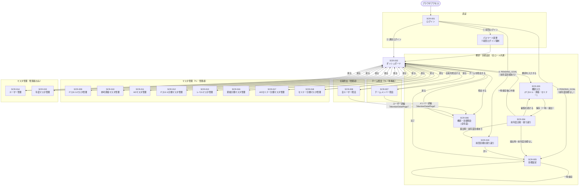
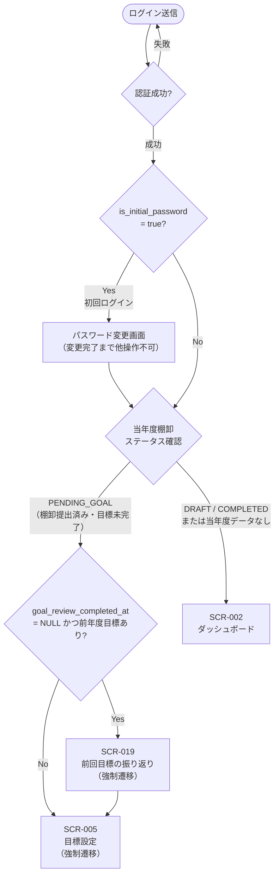
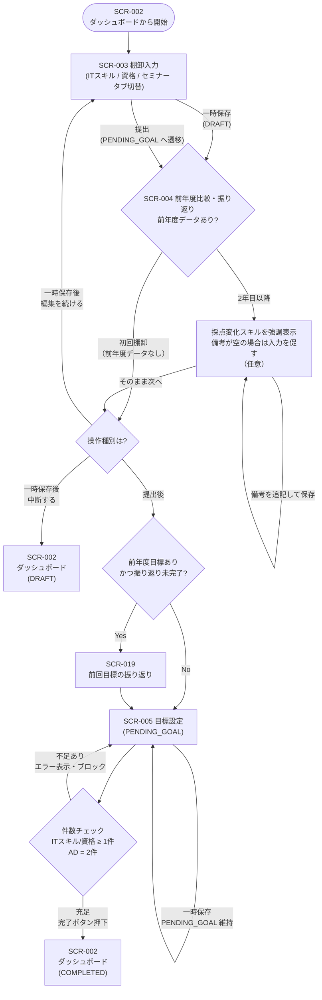

# 画面遷移図

**バージョン**: 1.1.0  
**作成日**: 2026-05-09  
**更新日**: 2026-05-17

---

## 1. 全体画面遷移図

---

## 2. 認証フロー詳細

---

## 3. 棚卸・目標設定フロー詳細

---

## 4. 画面アクセス権限一覧

| 画面ID | 画面名 | 一般 | TL | 管理者 |
|--------|--------|:----:|:--:|:------:|
| SCR-001 | ログイン | ○ | ○ | ○ |
| PWD | パスワード変更（初回強制） | ○ | ○ | ○ |
| SCR-002 | ダッシュボード | ○ | ○ | ○ |
| SCR-003 | 棚卸入力 | ○ | ○ | ○ |
| SCR-004 | 前年度比較・振り返り | ○ | ○ | ○ |
| SCR-019 | 前回目標の振り返り | ○ | ○ | ○ |
| SCR-005 | 目標設定 | ○ | ○ | ○ |
| SCR-006 | 棚卸・目標照会（自分用） MemberDetailPage（TL/ADMINがメンバー詳細を見る場合） 　└ ITスキル / 資格 / セミナー / 目標 / 面談メモ タブ（TL/ADMIN） 　└ 期待 タブ（TL/ADMINのみ表示） | ○（自分のみ） | ○（自分＋チーム） | ○（全員） |
| SCR-007 | チームメンバー照会 | - | ○ | ○ |
| SCR-008 | 全ユーザー照会 | - | - | ○ |
| SCR-009 | ITスキルマスタ管理 | - | ○ | ○ |
| SCR-010 | 参考資格マスタ管理 | - | ○ | ○ |
| SCR-011 | ADマスタ管理 | - | ○ | ○ |
| SCR-012 | ITスキル分類マスタ管理 | - | ○ | ○ |
| SCR-013 | レベルマスタ管理 | - | ○ | ○ |
| SCR-014 | ユーザー管理 | - | - | ○ |
| SCR-015 | 年度マスタ管理 | - | - | ○ |
| SCR-016 | 資格分類マスタ管理 | - | ○ | ○ |
| SCR-017 | ADセミナー分類マスタ管理 | - | ○ | ○ |
| SCR-018 | セミナー分類マスタ管理 | - | ○ | ○ |
